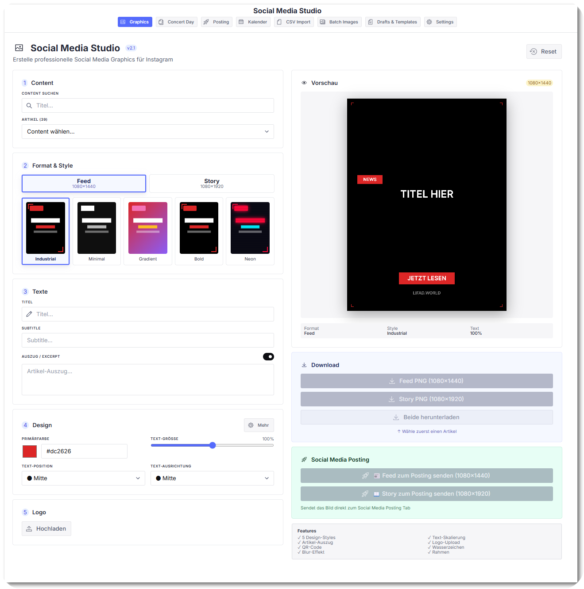
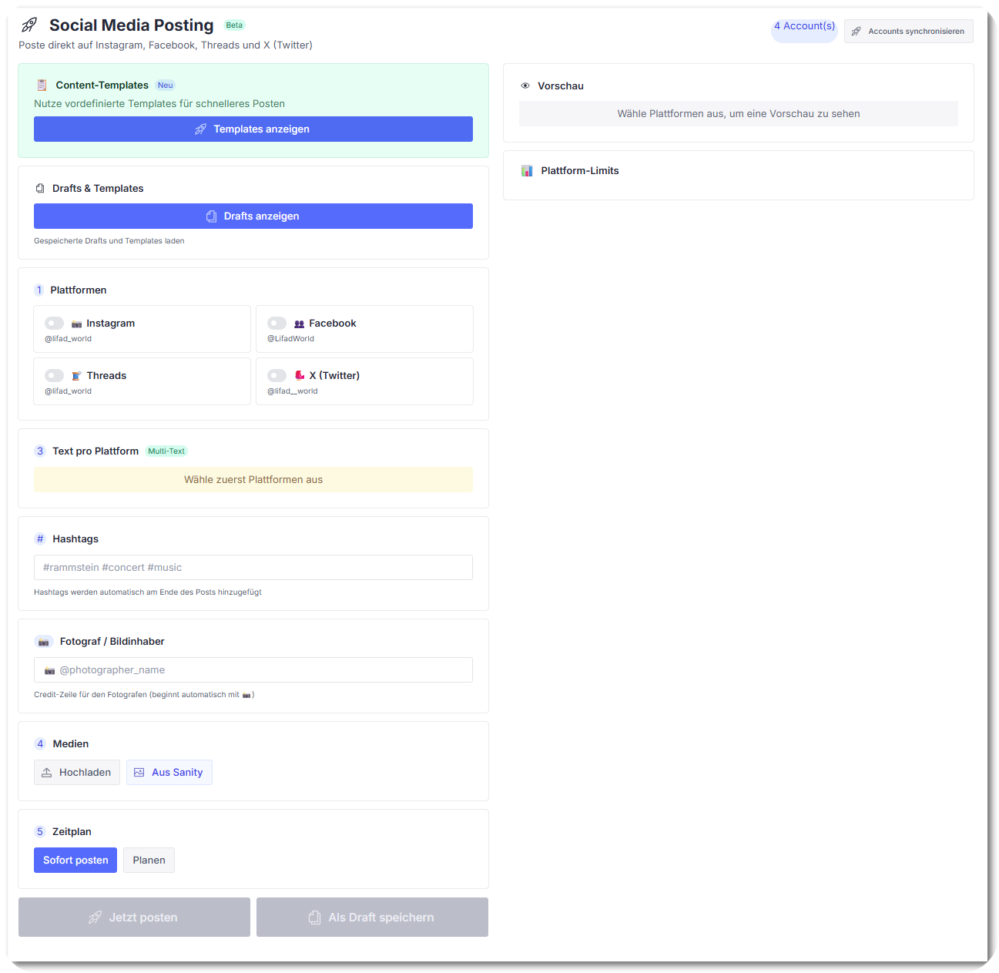
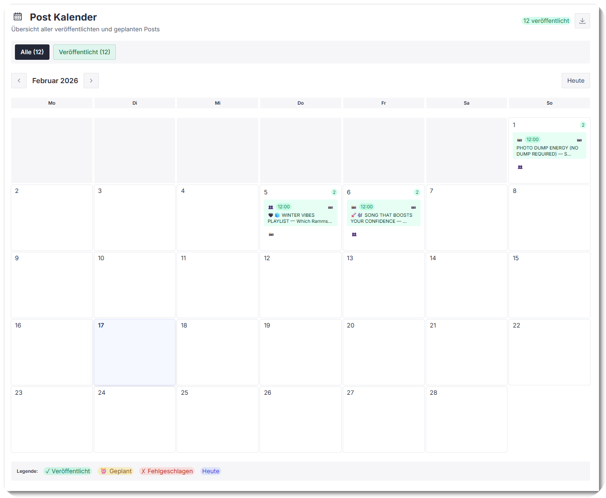
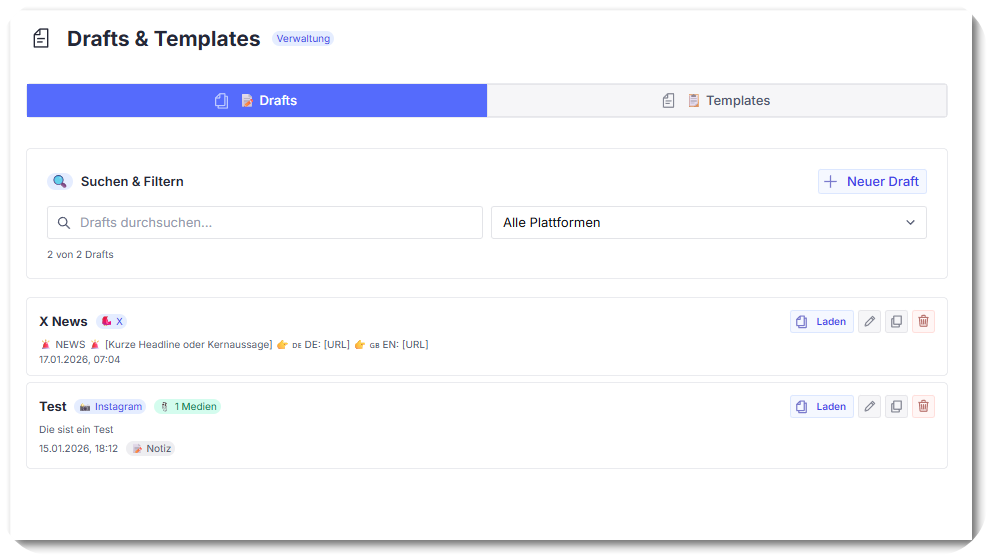

<div align="center">

# 🎨 Sanity Social Media Studio

**The all-in-one social media toolkit for Sanity Studio.**

Create stunning graphics, schedule posts, manage templates, and more — without ever leaving your CMS.

[](https://www.sanity.io/)
[](LICENSE)
[](https://nodejs.org/)
[](https://www.typescriptlang.org/)

</div>

> [!WARNING]
> **Early Release:** The installation as a standalone npm plugin has **not been tested yet**. This tool was originally built directly inside a Sanity Studio project and has been extracted into this repository. If you run into issues, please [open an issue](https://github.com/netz-sg/sanity-social-media-studio/issues).

---

## 👀 Preview

<details>
<summary><strong>🎨 Social Media Graphics</strong> — Design branded visuals with 5 built-in styles</summary>
<br>



</details>

<details>
<summary><strong>✏️ Post Creation</strong> — Compose & schedule posts for Instagram, Facebook, Threads & X</summary>
<br>



</details>

<details>
<summary><strong>📅 Post Calendar</strong> — Monthly overview of all scheduled & published posts</summary>
<br>



</details>

<details>
<summary><strong>📝 Drafts & Templates</strong> — Save drafts and reuse templates with dynamic placeholders</summary>
<br>



</details>

---

## ✨ Features

<table>
<tr>
<td width="50%" valign="top">

### 🎨 Graphics Studio
- 5 built-in styles — Industrial, Minimal, Gradient, Bold, Neon
- Multiple formats — Story, Square, Portrait, Facebook, X
- Live preview with real-time editing
- Custom watermark & logo support
- Content selection from Sanity documents
- Server-side rendering via `@napi-rs/canvas`

### 📱 Social Media Posting
- Multi-platform — Instagram, Facebook, Threads, X
- Schedule posts with timezone support
- Attach images & media
- Draft & template system
- Per-platform character count

### 📅 Post Calendar
- Monthly calendar view
- Visual status indicators (scheduled / published / failed)
- Quick actions from calendar entries

</td>
<td width="50%" valign="top">

### 📋 CSV Import
- Bulk import posts from CSV files
- Template mapping with placeholders
- Preview before import

### 🖼️ Batch Images
- Bulk image generation for multiple posts
- Consistent branding across all graphics

### 📝 Drafts & Templates
- Save post drafts for later
- Reusable templates with dynamic placeholders
- 8 categories — Concert, News, Giveaway, Tour, Aftershow, Release, Video, General

### ⚡ Document Actions
- One-click graphics from concert, news & aftershow documents
- Automatically opens Story + Feed format

</td>
</tr>
</table>

---

## 🚀 Quick Start

### 1. Install

```bash
npm install sanity-social-media-studio
```

### 2. Add the plugin

```ts
// sanity.config.ts
import { defineConfig } from 'sanity'
import { socialMediaStudioTool } from 'sanity-social-media-studio'

export default defineConfig({
  // ...
  plugins: [
    socialMediaStudioTool(),
  ],
})
```

### 3. Register schemas

```ts
import {
  socialMediaTemplateType,
  lateApiSettingsType,
} from 'sanity-social-media-studio'

export default defineConfig({
  // ...
  schema: {
    types: [
      socialMediaTemplateType,
      lateApiSettingsType,
    ],
  },
})
```

### 4. Add document actions *(optional)*

```ts
import {
  generateSocialGraphicsAction,
  generateNewsSocialGraphicsAction,
  generateAfterShowSocialGraphicsAction,
} from 'sanity-social-media-studio'

export default defineConfig({
  // ...
  document: {
    actions: (prev, context) => {
      if (context.schemaType === 'concert') {
        return [...prev, generateSocialGraphicsAction]
      }
      if (context.schemaType === 'post') {
        return [...prev, generateNewsSocialGraphicsAction]
      }
      if (context.schemaType === 'aftershowStory') {
        return [...prev, generateAfterShowSocialGraphicsAction]
      }
      return prev
    },
  },
})
```

---

## 🔌 API Routes (Next.js)

The plugin requires backend API routes for graphics rendering and social media posting.

<details>
<summary><strong>Social Graphics Endpoint</strong></summary>

```ts
// app/api/social-graphics/route.ts
import { NextRequest, NextResponse } from 'next/server'
import { renderSocialGraphic } from 'sanity-social-media-studio/lib'

export async function POST(req: NextRequest) {
  const body = await req.json()
  const buffer = await renderSocialGraphic(body)
  return new NextResponse(buffer, {
    headers: { 'Content-Type': 'image/png' },
  })
}
```

</details>

<details>
<summary><strong>Late API Proxy (Social Media Scheduling)</strong></summary>

The posting feature uses [Late](https://getlate.dev) as the scheduling backend:

```ts
// app/api/late/[...path]/route.ts
import { NextRequest, NextResponse } from 'next/server'

export async function POST(
  req: NextRequest,
  { params }: { params: { path: string[] } }
) {
  const apiKey = process.env.LATE_API_KEY
  const path = params.path.join('/')

  const response = await fetch(`https://api.getlate.dev/${path}`, {
    method: 'POST',
    headers: {
      'Authorization': `Bearer ${apiKey}`,
      'Content-Type': 'application/json',
    },
    body: JSON.stringify(await req.json()),
  })

  const data = await response.json()
  return NextResponse.json(data)
}
```

</details>

### Environment Variables

```env
LATE_API_KEY=sk_your_api_key_here
NEXT_PUBLIC_SANITY_PROJECT_ID=your_project_id
NEXT_PUBLIC_SANITY_DATASET=production
```

---

## ⚙️ Configuration

### Graphics Styles

| Style | Description |
|:------|:------------|
| **Industrial** | Bold, dark, high-contrast with industrial textures |
| **Minimal** | Clean, minimalist with subtle typography |
| **Gradient** | Vibrant gradient backgrounds with modern feel |
| **Bold** | Large, impactful text with strong colors |
| **Neon** | Glowing neon effects on dark backgrounds |

### Supported Platforms

| Platform | Post Types | Max Characters |
|:---------|:-----------|:--------------:|
| Instagram | Feed, Story, Reel, Carousel | 2,200 |
| Facebook | Post | 63,206 |
| Threads | Post | 500 |
| X (Twitter) | Tweet | 280 |

### Template Placeholders

| Placeholder | Description |
|:------------|:------------|
| `{title}` | Content title |
| `{date}` | Event date |
| `{time}` | Event time |
| `{location}` | Event location / city |
| `{venue}` | Venue name |
| `{band}` | Band / artist name |
| `{url}` | Link URL |
| `{price}` | Ticket price |

---

## 🏗️ Architecture

<details>
<summary>View project structure</summary>

```
src/
├── index.ts                         # Plugin entry (definePlugin)
├── lib/
│   ├── types.ts                     # Core types
│   ├── styles.ts                    # 5 built-in graphic styles
│   ├── renderer.ts                  # Server-side canvas renderer
│   └── index.ts
├── tools/
│   ├── SocialMediaStudioToolV2.tsx  # Main plugin UI (6 tabs)
│   ├── SocialMediaStudioTool.tsx    # Graphics Studio tab
│   └── ConcertDayGenerator.tsx      # Concert day generator
├── components/
│   ├── studio/                      # Graphics Studio UI
│   │   ├── ContentSelectionPanel.tsx
│   │   ├── FormatStylePanel.tsx
│   │   ├── TextContentPanel.tsx
│   │   ├── DesignSettingsPanel.tsx
│   │   ├── LogoSettingsPanel.tsx
│   │   ├── PreviewActionsPanel.tsx
│   │   ├── PreviewCanvas.tsx
│   │   ├── StyleThumbnail.tsx
│   │   ├── Slider.tsx
│   │   └── constants.ts
│   └── social-media/               # Social posting UI
│       ├── types.ts
│       ├── InstagramFormatSelector.tsx
│       ├── DeviceMockup.tsx
│       ├── SettingsTab.tsx
│       └── DraftsTemplatesTab.tsx
├── schemas/
│   ├── socialMediaTemplate.ts
│   ├── lateApiSettings.ts
│   └── index.ts
└── actions/
    ├── generateSocialGraphicsAction.ts
    ├── generateNewsSocialGraphicsAction.ts
    ├── generateAfterShowSocialGraphicsAction.ts
    └── index.ts
```

</details>

---

## 📋 Requirements

| Dependency | Version |
|:-----------|:--------|
| Sanity Studio | v3+ |
| React | 18 or 19 |
| @sanity/ui | v2+ |
| @sanity/icons | v3+ |
| Node.js | 18+ |
| @napi-rs/canvas | *(optional)* — server-side rendering |
| [Late](https://getlate.dev) | *(optional)* — social media scheduling |

---

## 🛠️ Development

```bash
git clone https://github.com/netz-sg/sanity-social-media-studio.git
cd sanity-social-media-studio
npm install
npm run build       # Production build
npm run dev         # Watch mode
```

---

## 🤝 Contributing

Contributions are welcome! Please [open an issue](https://github.com/netz-sg/sanity-social-media-studio/issues) or submit a pull request.

1. Fork the repository
2. Create your feature branch — `git checkout -b feature/amazing-feature`
3. Commit your changes — `git commit -m 'Add amazing feature'`
4. Push to the branch — `git push origin feature/amazing-feature`
5. Open a Pull Request

---

<div align="center">

## 📄 License

[MIT](LICENSE) © [netz-sg](https://github.com/netz-sg)

---

Built with [Sanity](https://www.sanity.io/) · Scheduling by [Late](https://getlate.dev) · Rendering by [@napi-rs/canvas](https://github.com/nicolo-ribaudo/canvas)

</div>
